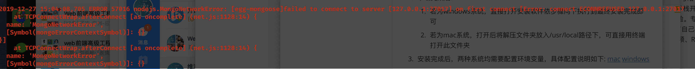

[TOC]

## 先看这个文档，实在不会问助教就好了！

## 美食杰项目启动说明

### MongoDB安装

首先如果电脑中没有mongodb数据库，则需要先安装数据库才可正常打开此项目。安装方法如下：

1. https://www.mongodb.com/download-center/enterprise 直接打开此链接选择对应平台对应版本下载安装包即可。
2. 下载完成后: 
   1. 若为windows系统，直接打开安装软件依步骤向下执行到最终安装完成即可
   2. 若为mac系统，打开后将解压文件夹放入/usr/local路径下，可直接用终端打开此文件夹
3. 安装完成后，两种系统均需要配置环境变量，具体配置说明如下: [mac](https://www.jianshu.com/p/7241f7c83f4a) [windows](https://blog.csdn.net/XUEER88888888888888/article/details/80036968)
4. 在终端中输入`mongod --version`，若正常能查看版本号即为安装成功并配置完成环境变量。
5. 补充一句，若有不会，可直接问助教~

### 启动项目

安装完成数据库之后，就可以准备启动整个项目了，但是在这之前，前后端部分需要分别执行`npm i/yarn`来安装对应依赖，前后端两部分代码均需要执行此命令，后端部分由eggjs搭建，前端部分则由vue+elementui搭建，所以安装完成后，后端部分在终端运行`npm run dev/yarn dev`，前端部分则在终端运行`npm run serve/yarn serve`(PS：前端部分依赖安装成功即可，但是后端部分切记当数据库启动后才可以正常启动，否则会报下面这个错误

所以如果看见了这个报错也不用慌，多半是忘了启动服务器)

前后端部分说完后，接下来就是数据库的启动，数据库启动直接执行`mongod --dbpath=mockdata文件夹目录`(/Users/zhangyuxuan/Downloads/代码/mongodb-mock-data 这个是我的文件夹目录，对应换成你的就好了)

在启动之后就可以启动上面所说过的启动前后端部分，此时应该可以正常启动项目了，但是如果发现没有数据，先不用着急，还有下一步。

### 导入数据

如果没有数据，那么你还需要执行这一步命令`mongorestore -h 127.0.0.1:27017 -d meishijie --dir mockdata文件夹目录`(/Users/zhangyuxuan/Downloads/代码/mongodb-mock-data 我依旧将我自己的目录放在这里供参考) 这个命令执行时一定要记得<strong>先启动数据库</strong>， 这样执行完成以后你刷新你的页面，应该就已经可以看见正常启动的项目了。