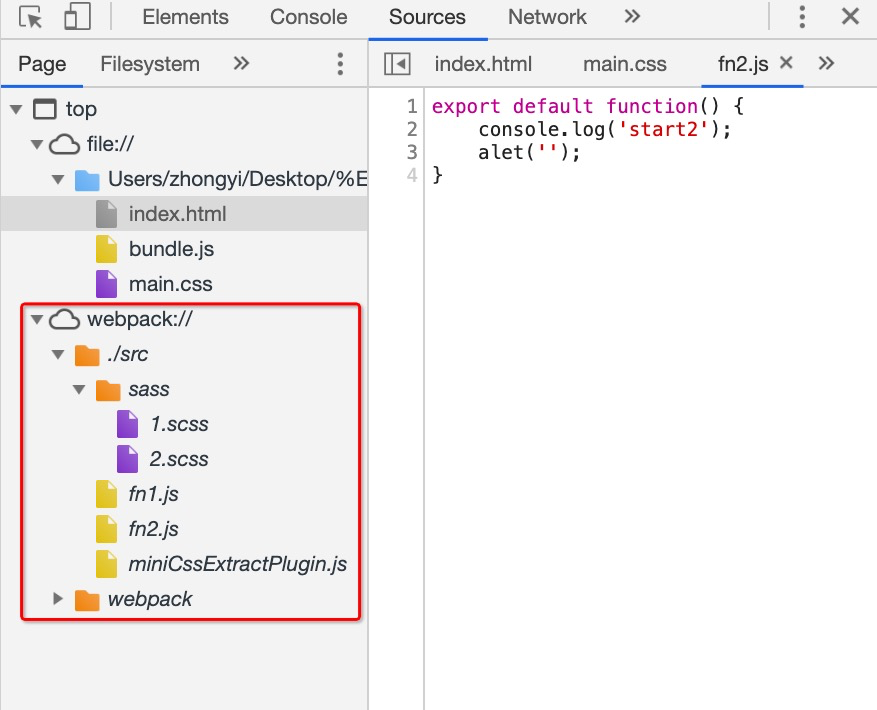

# webpack

[toc]

## 1、Plugins

扩展 `webpack` 本身的一些功能，它们会运行在 `webpack` 的不同阶段（钩子 / 生命周期）。

### 1-2、HtmlWebpackPlugin

在打包结束后，⾃动生成⼀个 `html` ⽂文件，并把打包生成的 js 模块引⼊到该 `html` 中

```bash
npm install --save-dev html-webpack-plugin
```

```js
// webpack.config.js
const HtmlWebpackPlugin = require("html-webpack-plugin");
module.exports = {
	...
  plugins: [
     new HtmlWebpackPlugin({
       title: "My App",
       filename: "app.html",
       template: "./src/html/index.html"
     }) 
  ]
};
```

```html
<!--./src/html/index.html-->
<!DOCTYPE htmlc x
<html lang="en">
<head>
    <meta charset="UTF-8">
    <meta name="viewport" content="width=device-width, initial-scale=1.0">
    <meta http-equiv="X-UA-Compatible" content="ie=edge">
    <title><%=htmlWebpackPlugin.options.title%></title>
</head>
<body>
    <h1>html-webpack-plugin</h1>
</body>
</html>
```

在 `html` 模板中，可以通过 `<%=htmlWebpackPlugin.options.XXX%>` 的方式获取配置的值

**更多的配置**

- `title`: ⽤来生成⻚面的 `title` 元素
- `filename`: 输出的 `HTML` ⽂件名，默认是 `index.html`， 也可以直接配置子目录
- `template`: 模板⽂件路径，⽀持加载器（`loader`），⽐如 `html!./index.html`
- `inject`: `true | 'head' | 'body' | false`，注⼊所有的资源到特定的 `template` 或者 `templateContent` 中，如果设置为 `true` 或者 `body`，所有的 `javascript` 资源将被放置到 `body` 元素的底部，`'head'` 将放置到 `head` 元素中
- `favicon`: 添加特定的 `favicon` 路径到输出的 `HTML` 文件中
- `minify`: `{} | false`， 传递 `html-minifier` 选项给 `minify` 输出
- `hash`: `true | false`，如果为 `true`，将添加 `webpack` 编译生成的 `hash` 到所有包含的脚本和 `CSS` ⽂件，对于解除 `cache` 很有用
- `cache`: `true | false`，如果为 `true`，这是默认值，仅在文件修改之后才会发布文件
- `showErrors`: `true | false`，如果为 `true`，这是默认值，错误信息会写入到 `HTML` ⻚面中
- `chunks`: 允许只添加某些块 (⽐如，仅 unit test 块)
- `chunksSortMode`: 允许控制块在添加到⻚面之前的排序方式，⽀持的值:`'none' | 'default' |{function}-default:'auto'`
- `excludeChunks`: 允许跳过某些块，(⽐如，跳过单元测试的块)

### 1-3、clean-webpack-plugin

删除（清理）构建目录

```bash
npm install --save-dev clean-webpack-plugin
```

```js
const {CleanWebpackPlugin} = require('clean-webpack-plugin');
module.exports = {
	...
  plugins: [
    ...,
    new CleanWebpackPlugin(),
    ...
  ]
}
```

### 1-4、mini-css-extract-plugin

提取 `CSS` 到一个单独的文件中

```bash
npm install --save-dev mini-css-extract-plugin
```

```js
const MiniCssExtractPlugin = require('mini-css-extract-plugin');
module.exports = {
	...,
  module: {
  	rules: [
  		{
  			test: /\.s[ac]ss$/,
  			use: [
  				{
  					loader: MiniCssExtractPlugin.loader
					},
          'css-loader',
          'sass-loader'
        ]
			}
  	]
	},
  plugins: [
    ...,
    new MiniCssExtractPlugin({
    	filename: '[name].css'
    }),
    ...
  ]
}
```


## 2、sourceMap

我们实际运行在浏览器的代码是通过 `webpack` 打包合并甚至是压缩混淆过的代码，所生成的代码并不利于我们的调试和错误定位，我们可以通过 `sourceMap` 来解决这个问题，`sourceMap` 本质是一个记录了编译后代码与源代码的映射关系的文件，我们可以通过 `webpack` 的 `devtool` 选项来开启 `sourceMap`

```js
module.exports = {
  mode: 'production',
  devtool: 'source-map',
  ...
}
```

首先，编译后会为每一个编译文件生成一个对应的 `.map` 文件，同时在编译文件中添加一段对应的 `map` 文件引入代码

```js
...
//# sourceMappingURL=xx.js.map
```

```css
...
/*# sourceMappingURL=xx.css.map*/
```

同时，现代浏览器都能够识别 `sourceMap` 文件，如 `chrome`，会在 `Sources` 面板中显示根据编译文件与对应的 `map` 文件定位到源文件中，有利于我们的调试和错误定位




## 3、WebpackDevServer

每次的代码修改都需要重新编译打包，刷新浏览器，特别麻烦，我们可以通过安装 `webpackDevServer` 来改善这方面的体验

```bash
npm install --save-dev webpack-dev-server
```

启动命令：

```bash
npx webpack-dev-server
```

或者，`package.json` 中添加 `scripts`

```js
...,
"scripts": {
  "server": "webpack-dev-server"
}
```

修改 `webpack.config.js`

```js
module.exports = {
  ...,
  devServer: {
  	// 扩展的虚拟路径
  	contentBase: "./abc",
  	// 自动开启浏览器
  	open: true,
  	// 端口
  	port: 8081
	}
}
```

启动服务以后，`webpack` 不在会把打包后的文件生成到硬盘真实目录中了，而是直接存在了内存中(同时虚拟了一个存放目录路径)，后期更新编译打包和访问速度大大提升

### 3-1、Proxy

当下前端的开发都是前后端分离开发的，前端开发过程中代码会运行在一个服务器环境下(如当前的 `WebpackDevServer`)，那么在处理一些后端请求的时候通常会出现跨域的问题。`WebpackDevServer` 内置了一个代理服务，通过内置代理就可以把我们的跨域请求转发目标服务器上(`WebpackDevServer` 内置的代理发送的请求属于后端 - `node`，不受同源策略限制)，具体如下：

<!--后端代码，以 node 为例-->

```js
const Koa = require('koa');
const KoaRouter = require('koa-router');

const app = new Koa();
const router = new KoaRouter();

router.get('/api/info', async ctx => {
    ctx.body = {
        username: 'zMouse',
        gender: 'male'
    }
})

app.use( router.routes() );
app.listen(8787);
```

<!--前端代码-->

```js
axios({
  url: 'http://localhost:8787/api/info'
}).then(res => {
  console.log('res',res.data);
})
```

默认情况下，该代码运行以后会出现跨域请求错误，修改 `webpack` 配置

```js
module.exports = {
  ...,
  devServer: {
  	// 生成的虚拟目录路径
  	contentBase: "./dist",
  	// 自动开启浏览器
  	open: true,
  	// 端口
  	port: 8081,
  	proxy: {
      '/api': {
      	target: 'http://localhost:8787'
    	}
    }
	}
}
```

通过 `proxy` 设置，当我们在当前 `WebpackDevServer` 环境下发送以 `/api` 开头的请求都会被转发到 http://localhost:8787 目标服务器下

<!--修改前端代码-->

```js
axios({
  //url: 'http://locahost:8081/api/info',
  url: '/api/info'
}).then(res => {
  console.log('res',res.data);
})
```

注意 `url` 地址要填写 `WebpackDevServer` 域，比如当前 `WebpackDevServer` 开启的是 http://localhost:8081，也就是我们当前前端代码运行的环境，那么请求的 `url` 也必须发送到这里，当我们的请求满足了 `proxy` 中设置的 `/api` 开头，那么就会把请求转发到 `target` ，所以最后的实际请求是：http://lcoahost:8787/api/info

### 3-2、Hot Module Replacement

在之前当代码有变化，我们使用的 `live reload`，也就是刷新整个页面，虽然这样为我们省掉了很多手动刷新页面的麻烦，但是这样即使只是修改了很小的内容，也会刷新整个页面，无法保持页面操作状态。`HMR` 随之就出现了，它的核心的局部（模块）更新，也就是不刷新页面，只更新变化的部分

```js
module.exports = {
  ...,
  devServer: {
  	// 生成的虚拟目录路径
  	contentBase: "./dist",
  	// 自动开启浏览器
  	open: true,
  	// 端口
  	port: 8081,
  	// 开启热更新
  	hot:true,
  	// 即使 HMR 不生效，也不去刷新整个页面(选择开启)
    hotOnly:true,
  	proxy: {
      '/api': {
      	target: 'http://localhost:8787'
    	}
    }
	}
}
```

开启 `HMR` 以后，当代码发生变化，`webpack` 即会进行编译，并通过 `websocket` 通知客户端(浏览器)，我们需要监听处理来自 `webpack` 的通知，然后通过 `HMR` 提供的  `API` 来完成我们的局部更新逻辑

<!--./fn1.js-->

```js
export default function() {
    console.log('start1!');
}
```

<!--index.js-->

```js
import fn1 from './fn1.js';
box1.onclick = fn1;

if (module.hot) {//如果开启 HMR
    module.hot.accept('./fn1.js', function() {
      // 更新逻辑
      box1.onclick = fn1;
    })
}
```

上面代码就是 当 ./fn1.js 模块代码发生变化的时候，把最新的 fn1 函数绑定到 box1.onclick 上

从上面就可以看到，`HMR` 其实就是以模块为单位，当模块代码发生修改的时候，通知客户端进行对应的更新，而客户端则根据具体的模块来更新我们的页面逻辑(这些逻辑需要自己去实现)，好在当前一些常用的更新逻辑都有了现成的插件

**css热更新**

样式热更新比较简单，`style-loader` 中就已经集成实现了，我们只需要在 `use` 中使用就可以了

**react 热更新**

- https://github.com/gaearon/react-hot-loader

- react 脚手架中也有集成

**vue 热更新**

- https://github.com/vuejs/vue-loader
- vue 脚手架中也有集成